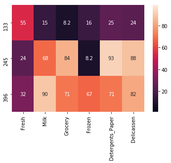
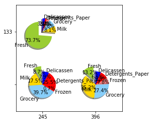
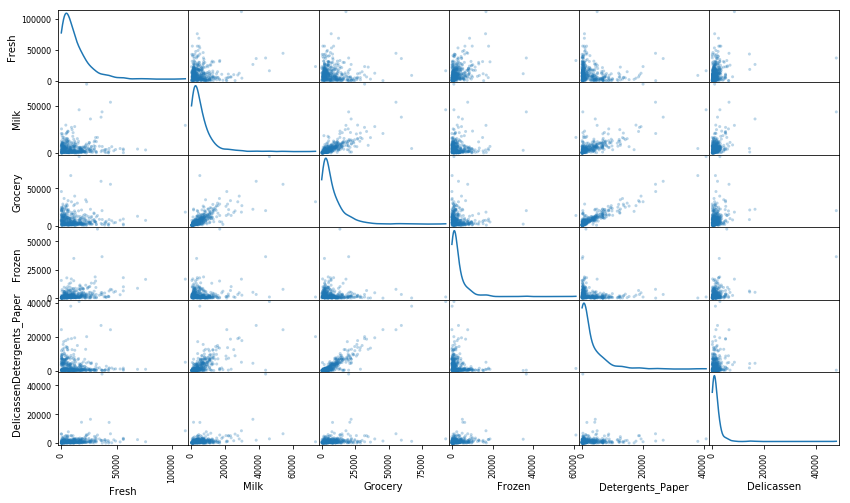
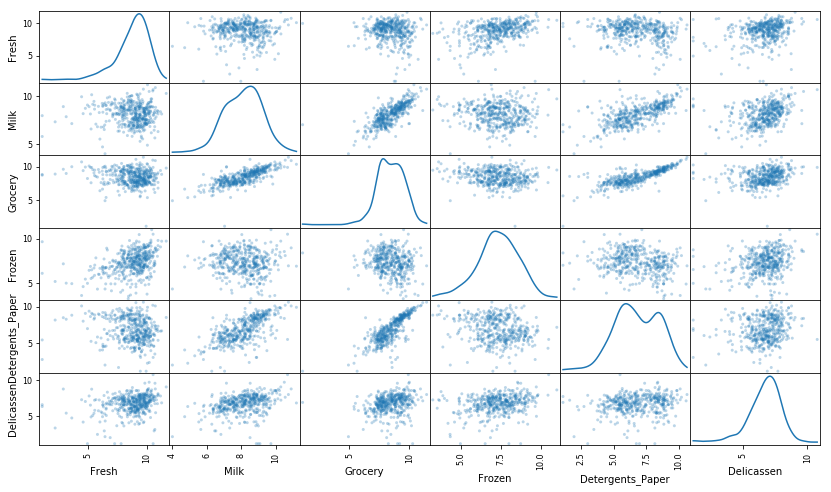
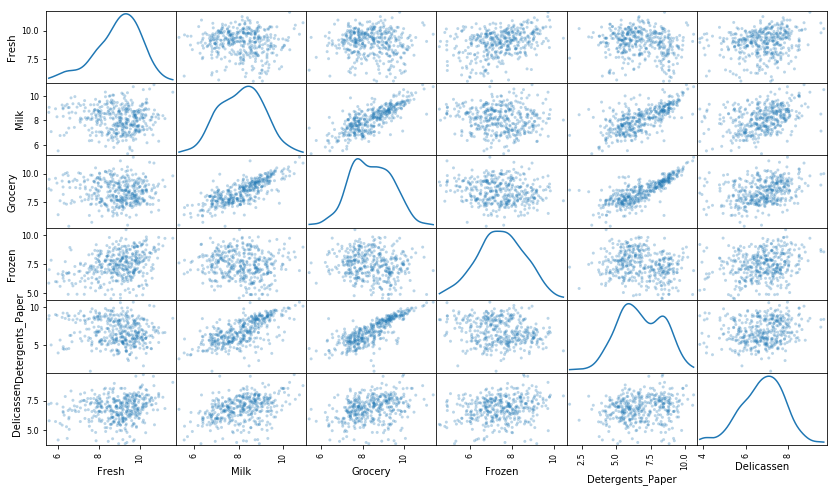
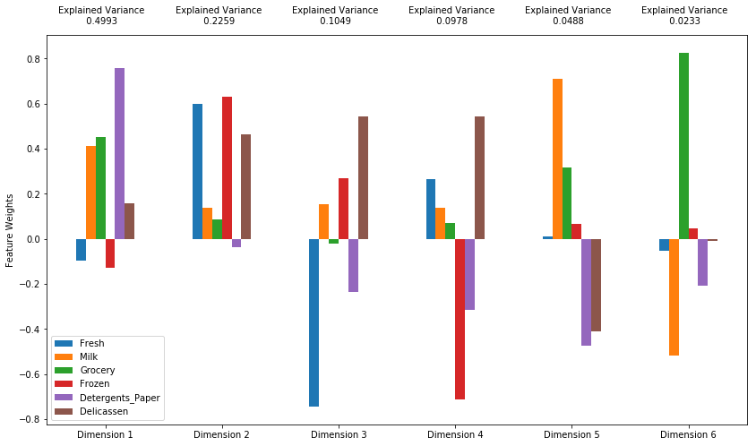
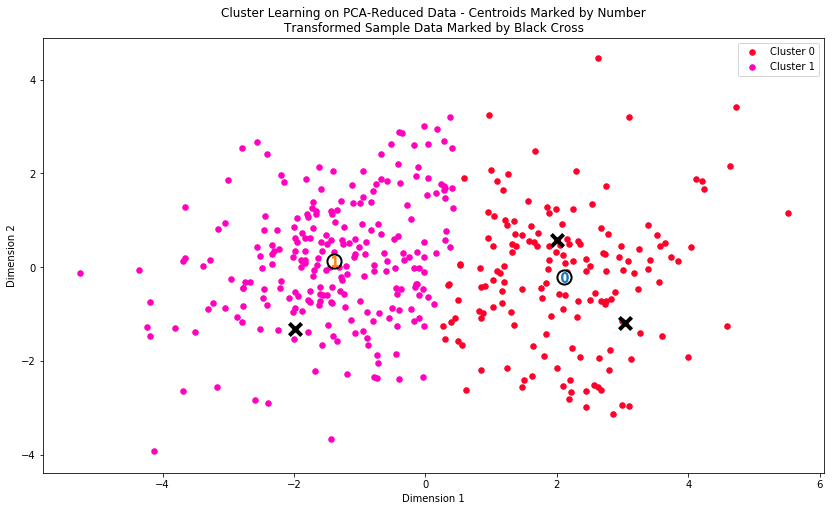
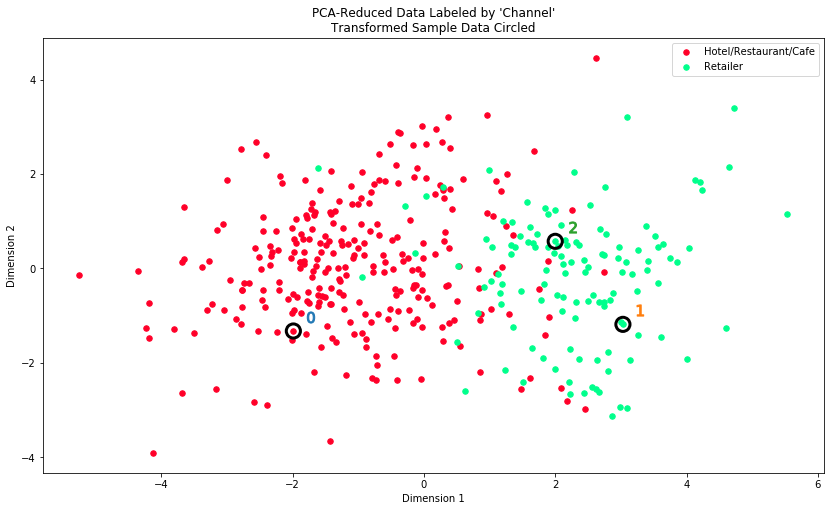

---

In this project, we will analyze a dataset containing data on various customers' annual spending amounts (reported in *monetary units*) of diverse product categories for internal structure. One goal of this project is to best describe the variation in the different types of customers that a wholesale distributor interacts with. Doing so would equip the distributor with insight into how to best structure their delivery service to meet the needs of each customer.

The dataset for this project can be found on the [UCI Machine Learning Repository](https://archive.ics.uci.edu/ml/datasets/Wholesale+customers). For the purposes of this project, the features `'Channel'` and `'Region'` will be excluded in the analysis — with focus instead on the six product categories recorded for customers.


```python
# Import libraries necessary for this project
import numpy as np
import pandas as pd
import seaborn as sns
import itertools
import renders as rs

import matplotlib.pyplot as plt
from IPython.display import display # Allows the use of display() for DataFrames
from sklearn.cross_validation import train_test_split
from sklearn.tree import DecisionTreeRegressor
import warnings
warnings.filterwarnings("ignore")
# Show matplotlib plots inline (nicely formatted in the notebook)
%matplotlib inline

# Load the wholesale customers dataset
try:
    data = pd.read_csv("Wholesale customers data.csv")
    data.drop(['Region', 'Channel'], axis = 1, inplace = True)
    print ("Wholesale customers dataset has {} samples with {} features each.".format(*data.shape))
except:
    print ("Dataset could not be loaded. Is the dataset missing?")
```

    Wholesale customers dataset has 440 samples with 6 features each.


    /anaconda3/lib/python3.6/site-packages/sklearn/cross_validation.py:41: DeprecationWarning: This module was deprecated in version 0.18 in favor of the model_selection module into which all the refactored classes and functions are moved. Also note that the interface of the new CV iterators are different from that of this module. This module will be removed in 0.20.
      "This module will be removed in 0.20.", DeprecationWarning)


# DATA EXPLORATION


```python
# Display a description of the dataset
data.describe()
```


<div>
<style scoped>
    .dataframe tbody tr th:only-of-type {
        vertical-align: middle;
    }

    .dataframe tbody tr th {
        vertical-align: top;
    }

    .dataframe thead th {
        text-align: right;
    }
</style>
<table border="1" class="dataframe">
  <thead>
    <tr style="text-align: right;">
      <th></th>
      <th>Fresh</th>
      <th>Milk</th>
      <th>Grocery</th>
      <th>Frozen</th>
      <th>Detergents_Paper</th>
      <th>Delicassen</th>
    </tr>
  </thead>
  <tbody>
    <tr>
      <th>count</th>
      <td>440.000000</td>
      <td>440.000000</td>
      <td>440.000000</td>
      <td>440.000000</td>
      <td>440.000000</td>
      <td>440.000000</td>
    </tr>
    <tr>
      <th>mean</th>
      <td>12000.297727</td>
      <td>5796.265909</td>
      <td>7951.277273</td>
      <td>3071.931818</td>
      <td>2881.493182</td>
      <td>1524.870455</td>
    </tr>
    <tr>
      <th>std</th>
      <td>12647.328865</td>
      <td>7380.377175</td>
      <td>9503.162829</td>
      <td>4854.673333</td>
      <td>4767.854448</td>
      <td>2820.105937</td>
    </tr>
    <tr>
      <th>min</th>
      <td>3.000000</td>
      <td>55.000000</td>
      <td>3.000000</td>
      <td>25.000000</td>
      <td>3.000000</td>
      <td>3.000000</td>
    </tr>
    <tr>
      <th>25%</th>
      <td>3127.750000</td>
      <td>1533.000000</td>
      <td>2153.000000</td>
      <td>742.250000</td>
      <td>256.750000</td>
      <td>408.250000</td>
    </tr>
    <tr>
      <th>50%</th>
      <td>8504.000000</td>
      <td>3627.000000</td>
      <td>4755.500000</td>
      <td>1526.000000</td>
      <td>816.500000</td>
      <td>965.500000</td>
    </tr>
    <tr>
      <th>75%</th>
      <td>16933.750000</td>
      <td>7190.250000</td>
      <td>10655.750000</td>
      <td>3554.250000</td>
      <td>3922.000000</td>
      <td>1820.250000</td>
    </tr>
    <tr>
      <th>max</th>
      <td>112151.000000</td>
      <td>73498.000000</td>
      <td>92780.000000</td>
      <td>60869.000000</td>
      <td>40827.000000</td>
      <td>47943.000000</td>
    </tr>
  </tbody>
</table>
</div>


```python
# TODO: Select three indices of your choice you wish to sample from the dataset
np.random.seed(15)
indices = np.random.choice(440, 3)
indices = np.sort(indices)
print(indices)

# Create a DataFrame of the chosen samples
samples = pd.DataFrame(data.loc[indices], columns = data.keys()).reset_index(drop = True)
print("Chosen samples of wholesale customers dataset:")
display(samples)

print("Quartile Visualization")
import seaborn as sns
percentiles = data.rank(pct=True)
percentiles = 100*percentiles.round(decimals=3)
percentiles = percentiles.iloc[indices]
_ = sns.heatmap(percentiles, vmin=1, vmax=99, annot=True)
```

    [133 245 396]
    Chosen samples of wholesale customers dataset:


<div>
<style scoped>
    .dataframe tbody tr th:only-of-type {
        vertical-align: middle;
    }

    .dataframe tbody tr th {
        vertical-align: top;
    }

    .dataframe thead th {
        text-align: right;
    }
</style>
<table border="1" class="dataframe">
  <thead>
    <tr style="text-align: right;">
      <th></th>
      <th>Fresh</th>
      <th>Milk</th>
      <th>Grocery</th>
      <th>Frozen</th>
      <th>Detergents_Paper</th>
      <th>Delicassen</th>
    </tr>
  </thead>
  <tbody>
    <tr>
      <th>0</th>
      <td>9434</td>
      <td>1042</td>
      <td>1235</td>
      <td>436</td>
      <td>256</td>
      <td>396</td>
    </tr>
    <tr>
      <th>1</th>
      <td>3062</td>
      <td>6154</td>
      <td>13916</td>
      <td>230</td>
      <td>8933</td>
      <td>2784</td>
    </tr>
    <tr>
      <th>2</th>
      <td>4515</td>
      <td>11991</td>
      <td>9345</td>
      <td>2644</td>
      <td>3378</td>
      <td>2213</td>
    </tr>
  </tbody>
</table>
</div>


    Quartile Visualization





```python
dt = data.copy()
dt['Total'] = dt.sum(axis=1)

for key in dt.keys():
    dt[key] = dt[key] / dt.Total * 100

dt = dt.drop(['Total'], axis =1)
sps = pd.DataFrame(dt.loc[indices], columns = dt.keys()).reset_index(drop = True)
print('Percentage of each categories (display by % below):')
display(sps)

import matplotlib.pyplot as plt

# The slices will be ordered and plotted counter-clockwise.
labels = dt.keys()
colors = ['yellowgreen', 'gold', 'lightskyblue', 'lightcoral', 'red','blue']
explode = (0.1, 0, 0, 0, 0, 0) 

fig = plt.figure()
ax = fig.gca()

ax.pie(np.array(sps.iloc[[0]]).reshape(6,), explode=explode, labels=labels, colors=colors,
       autopct='%1.1f%%', shadow=True, startangle=90,
       radius=0.25, center=(0, 1), frame=True)
ax.pie(np.array(sps.iloc[[2]]).reshape(6,), explode=explode, labels=labels, colors=colors,
       autopct='%1.1f%%', shadow=True, startangle=90,
       radius=0.25, center=(1, 0), frame=True)
ax.pie(np.array(sps.iloc[[1]]).reshape(6,), explode=explode, labels=labels, colors=colors,
       autopct='%1.1f%%', shadow=True, startangle=90,
       radius=0.25, center=(0, 0), frame=True)

ax.set_xticks([0, 1])
ax.set_yticks([0, 1])
ax.set_xticklabels(["245", "396"])
ax.set_yticklabels(["", "133"])
ax.set_xlim((-0.5, 1.5))
ax.set_ylim((-0.5, 1.5))

# Set aspect ratio to be equal so that pie is drawn as a circle.
ax.set_aspect('equal')

plt.show()

print('Chosen samples standardized by mean of dataset:')
display((samples - np.around(data.mean().values)) / data.std())

print('Chosen samples offset from median of dataset:')
display(samples - np.around(data.median().values))

print('Total of six categories:')
print(samples.sum(axis=1))
```

    Percentage of each categories (display by % below):


<div>
<style scoped>
    .dataframe tbody tr th:only-of-type {
        vertical-align: middle;
    }

    .dataframe tbody tr th {
        vertical-align: top;
    }

    .dataframe thead th {
        text-align: right;
    }
</style>
<table border="1" class="dataframe">
  <thead>
    <tr style="text-align: right;">
      <th></th>
      <th>Fresh</th>
      <th>Milk</th>
      <th>Grocery</th>
      <th>Frozen</th>
      <th>Detergents_Paper</th>
      <th>Delicassen</th>
    </tr>
  </thead>
  <tbody>
    <tr>
      <th>0</th>
      <td>73.708884</td>
      <td>8.141261</td>
      <td>9.649191</td>
      <td>3.406516</td>
      <td>2.000156</td>
      <td>3.093992</td>
    </tr>
    <tr>
      <th>1</th>
      <td>8.728869</td>
      <td>17.543259</td>
      <td>39.670458</td>
      <td>0.655663</td>
      <td>25.465378</td>
      <td>7.936372</td>
    </tr>
    <tr>
      <th>2</th>
      <td>13.245907</td>
      <td>35.178666</td>
      <td>27.415948</td>
      <td>7.756850</td>
      <td>9.910227</td>
      <td>6.492402</td>
    </tr>
  </tbody>
</table>
</div>





    Chosen samples standardized by mean of dataset:


<div>
<style scoped>
    .dataframe tbody tr th:only-of-type {
        vertical-align: middle;
    }

    .dataframe tbody tr th {
        vertical-align: top;
    }

    .dataframe thead th {
        text-align: right;
    }
</style>
<table border="1" class="dataframe">
  <thead>
    <tr style="text-align: right;">
      <th></th>
      <th>Fresh</th>
      <th>Milk</th>
      <th>Grocery</th>
      <th>Frozen</th>
      <th>Detergents_Paper</th>
      <th>Delicassen</th>
    </tr>
  </thead>
  <tbody>
    <tr>
      <th>0</th>
      <td>-0.202889</td>
      <td>-0.644141</td>
      <td>-0.706712</td>
      <td>-0.542982</td>
      <td>-0.550562</td>
      <td>-0.400340</td>
    </tr>
    <tr>
      <th>1</th>
      <td>-0.706710</td>
      <td>0.048507</td>
      <td>0.627686</td>
      <td>-0.585415</td>
      <td>1.269334</td>
      <td>0.446437</td>
    </tr>
    <tr>
      <th>2</th>
      <td>-0.591825</td>
      <td>0.839388</td>
      <td>0.146688</td>
      <td>-0.088162</td>
      <td>0.104240</td>
      <td>0.243962</td>
    </tr>
  </tbody>
</table>
</div>


    Chosen samples offset from median of dataset:


<div>
<style scoped>
    .dataframe tbody tr th:only-of-type {
        vertical-align: middle;
    }

    .dataframe tbody tr th {
        vertical-align: top;
    }

    .dataframe thead th {
        text-align: right;
    }
</style>
<table border="1" class="dataframe">
  <thead>
    <tr style="text-align: right;">
      <th></th>
      <th>Fresh</th>
      <th>Milk</th>
      <th>Grocery</th>
      <th>Frozen</th>
      <th>Detergents_Paper</th>
      <th>Delicassen</th>
    </tr>
  </thead>
  <tbody>
    <tr>
      <th>0</th>
      <td>930.0</td>
      <td>-2585.0</td>
      <td>-3521.0</td>
      <td>-1090.0</td>
      <td>-560.0</td>
      <td>-570.0</td>
    </tr>
    <tr>
      <th>1</th>
      <td>-5442.0</td>
      <td>2527.0</td>
      <td>9160.0</td>
      <td>-1296.0</td>
      <td>8117.0</td>
      <td>1818.0</td>
    </tr>
    <tr>
      <th>2</th>
      <td>-3989.0</td>
      <td>8364.0</td>
      <td>4589.0</td>
      <td>1118.0</td>
      <td>2562.0</td>
      <td>1247.0</td>
    </tr>
  </tbody>
</table>
</div>


    Total of six categories:
    0    12799
    1    35079
    2    34086
    dtype: int64


```python
# TODO: Make a copy of the DataFrame, using the 'drop' function to drop the given feature
new_data = data.copy()
# keys=['Fresh','Milk','Grocery','Frozen','Detergents_Paper','Delicatessen']
drop_key = 'Detergents_Paper'
target_label = new_data[drop_key]
new_data = new_data.drop([drop_key], axis = 1)

# TODO: Split the data into training and testing sets using the given feature as the target
from sklearn.cross_validation import train_test_split
X_train, X_test, y_train, y_test = train_test_split(new_data, target_label, test_size=0.25, random_state=1)

# TODO: Create a decision tree regressor and fit it to the training set
from sklearn.tree import DecisionTreeRegressor
regressor = DecisionTreeRegressor(random_state=20,max_depth=3)
regressor = regressor.fit(X_train, y_train)
y_pred = regressor.predict(X_test)

# TODO: Report the score of the prediction using the testing set
score = regressor.score(X_test, y_test)
print(score)
```

    0.8392354358103181


```python
# Produce a scatter matrix for each pair of features in the data
pd.scatter_matrix(data, alpha = 0.3, figsize = (14,8), diagonal = 'kde');
```





# Data Preprocessing


```python
# TODO: Scale the data using the natural logarithm
log_data = np.log(data).copy()

# TODO: Scale the sample data using the natural logarithm
log_samples = np.log(samples).copy()

# Produce a scatter matrix for each pair of newly-transformed features
pd.scatter_matrix(log_data, alpha = 0.3, figsize = (14,8), diagonal = 'kde');

```





```python
# Display the log-transformed sample data
display(log_samples)

```


<div>
<style scoped>
    .dataframe tbody tr th:only-of-type {
        vertical-align: middle;
    }

    .dataframe tbody tr th {
        vertical-align: top;
    }

    .dataframe thead th {
        text-align: right;
    }
</style>
<table border="1" class="dataframe">
  <thead>
    <tr style="text-align: right;">
      <th></th>
      <th>Fresh</th>
      <th>Milk</th>
      <th>Grocery</th>
      <th>Frozen</th>
      <th>Detergents_Paper</th>
      <th>Delicassen</th>
    </tr>
  </thead>
  <tbody>
    <tr>
      <th>0</th>
      <td>9.152075</td>
      <td>6.948897</td>
      <td>7.118826</td>
      <td>6.077642</td>
      <td>5.545177</td>
      <td>5.981414</td>
    </tr>
    <tr>
      <th>1</th>
      <td>8.026824</td>
      <td>8.724858</td>
      <td>9.540795</td>
      <td>5.438079</td>
      <td>9.097508</td>
      <td>7.931644</td>
    </tr>
    <tr>
      <th>2</th>
      <td>8.415160</td>
      <td>9.391912</td>
      <td>9.142597</td>
      <td>7.880048</td>
      <td>8.125039</td>
      <td>7.702104</td>
    </tr>
  </tbody>
</table>
</div>


```python
# For each feature find the data points with extreme high or low values
outliers = np.array([], dtype='int64')
for feature in log_data.keys():
    
    # TODO: Calculate Q1 (25th percentile of the data) for the given feature
    Q1 = np.percentile(log_data[feature], 25)
    
    # TODO: Calculate Q3 (75th percentile of the data) for the given feature
    Q3 = np.percentile(log_data[feature], 75)
    
    # TODO: Use the interquartile range to calculate an outlier step (1.5 times the interquartile range)
    step = 1.5*(Q3-Q1)
    
    # Display the outliers
    print("Data points considered outliers for the feature '{}':".format(feature))
    print("Numbers of outlier of '%s': %s" %(feature, 
                                           log_data[~((log_data[feature] >= Q1 - step) & (log_data[feature] <= Q3 + step))].count()[feature]))
    display(log_data[~((log_data[feature] >= Q1 - step) & (log_data[feature] <= Q3 + step))])
    ol = log_data[~((log_data[feature] >= Q1 - step) & (log_data[feature] <= Q3 + step))].index.values
    outliers = np.append(outliers,ol)
    
# OPTIONAL: Select the indices for data points you wish to remove
multiple_outliers, indices = np.unique(outliers, return_inverse=True)
counts = np.bincount(indices)
multiple_outliers = multiple_outliers[counts>1]
outliers = np.unique(outliers)
print(multiple_outliers)
print(outliers)

# Remove the outliers, if any were specified
good_data = log_data.drop(log_data.index[outliers]).reset_index(drop = True)
```

    Data points considered outliers for the feature 'Fresh':
    Numbers of outlier of 'Fresh': 16


<div>
<style scoped>
    .dataframe tbody tr th:only-of-type {
        vertical-align: middle;
    }

    .dataframe tbody tr th {
        vertical-align: top;
    }

    .dataframe thead th {
        text-align: right;
    }
</style>
<table border="1" class="dataframe">
  <thead>
    <tr style="text-align: right;">
      <th></th>
      <th>Fresh</th>
      <th>Milk</th>
      <th>Grocery</th>
      <th>Frozen</th>
      <th>Detergents_Paper</th>
      <th>Delicassen</th>
    </tr>
  </thead>
  <tbody>
    <tr>
      <th>65</th>
      <td>4.442651</td>
      <td>9.950323</td>
      <td>10.732651</td>
      <td>3.583519</td>
      <td>10.095388</td>
      <td>7.260523</td>
    </tr>
    <tr>
      <th>66</th>
      <td>2.197225</td>
      <td>7.335634</td>
      <td>8.911530</td>
      <td>5.164786</td>
      <td>8.151333</td>
      <td>3.295837</td>
    </tr>
    <tr>
      <th>81</th>
      <td>5.389072</td>
      <td>9.163249</td>
      <td>9.575192</td>
      <td>5.645447</td>
      <td>8.964184</td>
      <td>5.049856</td>
    </tr>
    <tr>
      <th>95</th>
      <td>1.098612</td>
      <td>7.979339</td>
      <td>8.740657</td>
      <td>6.086775</td>
      <td>5.407172</td>
      <td>6.563856</td>
    </tr>
    <tr>
      <th>96</th>
      <td>3.135494</td>
      <td>7.869402</td>
      <td>9.001839</td>
      <td>4.976734</td>
      <td>8.262043</td>
      <td>5.379897</td>
    </tr>
    <tr>
      <th>128</th>
      <td>4.941642</td>
      <td>9.087834</td>
      <td>8.248791</td>
      <td>4.955827</td>
      <td>6.967909</td>
      <td>1.098612</td>
    </tr>
    <tr>
      <th>171</th>
      <td>5.298317</td>
      <td>10.160530</td>
      <td>9.894245</td>
      <td>6.478510</td>
      <td>9.079434</td>
      <td>8.740337</td>
    </tr>
    <tr>
      <th>193</th>
      <td>5.192957</td>
      <td>8.156223</td>
      <td>9.917982</td>
      <td>6.865891</td>
      <td>8.633731</td>
      <td>6.501290</td>
    </tr>
    <tr>
      <th>218</th>
      <td>2.890372</td>
      <td>8.923191</td>
      <td>9.629380</td>
      <td>7.158514</td>
      <td>8.475746</td>
      <td>8.759669</td>
    </tr>
    <tr>
      <th>304</th>
      <td>5.081404</td>
      <td>8.917311</td>
      <td>10.117510</td>
      <td>6.424869</td>
      <td>9.374413</td>
      <td>7.787382</td>
    </tr>
    <tr>
      <th>305</th>
      <td>5.493061</td>
      <td>9.468001</td>
      <td>9.088399</td>
      <td>6.683361</td>
      <td>8.271037</td>
      <td>5.351858</td>
    </tr>
    <tr>
      <th>338</th>
      <td>1.098612</td>
      <td>5.808142</td>
      <td>8.856661</td>
      <td>9.655090</td>
      <td>2.708050</td>
      <td>6.309918</td>
    </tr>
    <tr>
      <th>353</th>
      <td>4.762174</td>
      <td>8.742574</td>
      <td>9.961898</td>
      <td>5.429346</td>
      <td>9.069007</td>
      <td>7.013016</td>
    </tr>
    <tr>
      <th>355</th>
      <td>5.247024</td>
      <td>6.588926</td>
      <td>7.606885</td>
      <td>5.501258</td>
      <td>5.214936</td>
      <td>4.844187</td>
    </tr>
    <tr>
      <th>357</th>
      <td>3.610918</td>
      <td>7.150701</td>
      <td>10.011086</td>
      <td>4.919981</td>
      <td>8.816853</td>
      <td>4.700480</td>
    </tr>
    <tr>
      <th>412</th>
      <td>4.574711</td>
      <td>8.190077</td>
      <td>9.425452</td>
      <td>4.584967</td>
      <td>7.996317</td>
      <td>4.127134</td>
    </tr>
  </tbody>
</table>
</div>


    Data points considered outliers for the feature 'Milk':
    Numbers of outlier of 'Milk': 4


<div>
<style scoped>
    .dataframe tbody tr th:only-of-type {
        vertical-align: middle;
    }

    .dataframe tbody tr th {
        vertical-align: top;
    }

    .dataframe thead th {
        text-align: right;
    }
</style>
<table border="1" class="dataframe">
  <thead>
    <tr style="text-align: right;">
      <th></th>
      <th>Fresh</th>
      <th>Milk</th>
      <th>Grocery</th>
      <th>Frozen</th>
      <th>Detergents_Paper</th>
      <th>Delicassen</th>
    </tr>
  </thead>
  <tbody>
    <tr>
      <th>86</th>
      <td>10.039983</td>
      <td>11.205013</td>
      <td>10.377047</td>
      <td>6.894670</td>
      <td>9.906981</td>
      <td>6.805723</td>
    </tr>
    <tr>
      <th>98</th>
      <td>6.220590</td>
      <td>4.718499</td>
      <td>6.656727</td>
      <td>6.796824</td>
      <td>4.025352</td>
      <td>4.882802</td>
    </tr>
    <tr>
      <th>154</th>
      <td>6.432940</td>
      <td>4.007333</td>
      <td>4.919981</td>
      <td>4.317488</td>
      <td>1.945910</td>
      <td>2.079442</td>
    </tr>
    <tr>
      <th>356</th>
      <td>10.029503</td>
      <td>4.897840</td>
      <td>5.384495</td>
      <td>8.057377</td>
      <td>2.197225</td>
      <td>6.306275</td>
    </tr>
  </tbody>
</table>
</div>


    Data points considered outliers for the feature 'Grocery':
    Numbers of outlier of 'Grocery': 2


<div>
<style scoped>
    .dataframe tbody tr th:only-of-type {
        vertical-align: middle;
    }

    .dataframe tbody tr th {
        vertical-align: top;
    }

    .dataframe thead th {
        text-align: right;
    }
</style>
<table border="1" class="dataframe">
  <thead>
    <tr style="text-align: right;">
      <th></th>
      <th>Fresh</th>
      <th>Milk</th>
      <th>Grocery</th>
      <th>Frozen</th>
      <th>Detergents_Paper</th>
      <th>Delicassen</th>
    </tr>
  </thead>
  <tbody>
    <tr>
      <th>75</th>
      <td>9.923192</td>
      <td>7.036148</td>
      <td>1.098612</td>
      <td>8.390949</td>
      <td>1.098612</td>
      <td>6.882437</td>
    </tr>
    <tr>
      <th>154</th>
      <td>6.432940</td>
      <td>4.007333</td>
      <td>4.919981</td>
      <td>4.317488</td>
      <td>1.945910</td>
      <td>2.079442</td>
    </tr>
  </tbody>
</table>
</div>


    Data points considered outliers for the feature 'Frozen':
    Numbers of outlier of 'Frozen': 10


<div>
<style scoped>
    .dataframe tbody tr th:only-of-type {
        vertical-align: middle;
    }

    .dataframe tbody tr th {
        vertical-align: top;
    }

    .dataframe thead th {
        text-align: right;
    }
</style>
<table border="1" class="dataframe">
  <thead>
    <tr style="text-align: right;">
      <th></th>
      <th>Fresh</th>
      <th>Milk</th>
      <th>Grocery</th>
      <th>Frozen</th>
      <th>Detergents_Paper</th>
      <th>Delicassen</th>
    </tr>
  </thead>
  <tbody>
    <tr>
      <th>38</th>
      <td>8.431853</td>
      <td>9.663261</td>
      <td>9.723703</td>
      <td>3.496508</td>
      <td>8.847360</td>
      <td>6.070738</td>
    </tr>
    <tr>
      <th>57</th>
      <td>8.597297</td>
      <td>9.203618</td>
      <td>9.257892</td>
      <td>3.637586</td>
      <td>8.932213</td>
      <td>7.156177</td>
    </tr>
    <tr>
      <th>65</th>
      <td>4.442651</td>
      <td>9.950323</td>
      <td>10.732651</td>
      <td>3.583519</td>
      <td>10.095388</td>
      <td>7.260523</td>
    </tr>
    <tr>
      <th>145</th>
      <td>10.000569</td>
      <td>9.034080</td>
      <td>10.457143</td>
      <td>3.737670</td>
      <td>9.440738</td>
      <td>8.396155</td>
    </tr>
    <tr>
      <th>175</th>
      <td>7.759187</td>
      <td>8.967632</td>
      <td>9.382106</td>
      <td>3.951244</td>
      <td>8.341887</td>
      <td>7.436617</td>
    </tr>
    <tr>
      <th>264</th>
      <td>6.978214</td>
      <td>9.177714</td>
      <td>9.645041</td>
      <td>4.110874</td>
      <td>8.696176</td>
      <td>7.142827</td>
    </tr>
    <tr>
      <th>325</th>
      <td>10.395650</td>
      <td>9.728181</td>
      <td>9.519735</td>
      <td>11.016479</td>
      <td>7.148346</td>
      <td>8.632128</td>
    </tr>
    <tr>
      <th>420</th>
      <td>8.402007</td>
      <td>8.569026</td>
      <td>9.490015</td>
      <td>3.218876</td>
      <td>8.827321</td>
      <td>7.239215</td>
    </tr>
    <tr>
      <th>429</th>
      <td>9.060331</td>
      <td>7.467371</td>
      <td>8.183118</td>
      <td>3.850148</td>
      <td>4.430817</td>
      <td>7.824446</td>
    </tr>
    <tr>
      <th>439</th>
      <td>7.932721</td>
      <td>7.437206</td>
      <td>7.828038</td>
      <td>4.174387</td>
      <td>6.167516</td>
      <td>3.951244</td>
    </tr>
  </tbody>
</table>
</div>


    Data points considered outliers for the feature 'Detergents_Paper':
    Numbers of outlier of 'Detergents_Paper': 2


<div>
<style scoped>
    .dataframe tbody tr th:only-of-type {
        vertical-align: middle;
    }

    .dataframe tbody tr th {
        vertical-align: top;
    }

    .dataframe thead th {
        text-align: right;
    }
</style>
<table border="1" class="dataframe">
  <thead>
    <tr style="text-align: right;">
      <th></th>
      <th>Fresh</th>
      <th>Milk</th>
      <th>Grocery</th>
      <th>Frozen</th>
      <th>Detergents_Paper</th>
      <th>Delicassen</th>
    </tr>
  </thead>
  <tbody>
    <tr>
      <th>75</th>
      <td>9.923192</td>
      <td>7.036148</td>
      <td>1.098612</td>
      <td>8.390949</td>
      <td>1.098612</td>
      <td>6.882437</td>
    </tr>
    <tr>
      <th>161</th>
      <td>9.428190</td>
      <td>6.291569</td>
      <td>5.645447</td>
      <td>6.995766</td>
      <td>1.098612</td>
      <td>7.711101</td>
    </tr>
  </tbody>
</table>
</div>


    Data points considered outliers for the feature 'Delicassen':
    Numbers of outlier of 'Delicassen': 14


<div>
<style scoped>
    .dataframe tbody tr th:only-of-type {
        vertical-align: middle;
    }

    .dataframe tbody tr th {
        vertical-align: top;
    }

    .dataframe thead th {
        text-align: right;
    }
</style>
<table border="1" class="dataframe">
  <thead>
    <tr style="text-align: right;">
      <th></th>
      <th>Fresh</th>
      <th>Milk</th>
      <th>Grocery</th>
      <th>Frozen</th>
      <th>Detergents_Paper</th>
      <th>Delicassen</th>
    </tr>
  </thead>
  <tbody>
    <tr>
      <th>66</th>
      <td>2.197225</td>
      <td>7.335634</td>
      <td>8.911530</td>
      <td>5.164786</td>
      <td>8.151333</td>
      <td>3.295837</td>
    </tr>
    <tr>
      <th>109</th>
      <td>7.248504</td>
      <td>9.724899</td>
      <td>10.274568</td>
      <td>6.511745</td>
      <td>6.728629</td>
      <td>1.098612</td>
    </tr>
    <tr>
      <th>128</th>
      <td>4.941642</td>
      <td>9.087834</td>
      <td>8.248791</td>
      <td>4.955827</td>
      <td>6.967909</td>
      <td>1.098612</td>
    </tr>
    <tr>
      <th>137</th>
      <td>8.034955</td>
      <td>8.997147</td>
      <td>9.021840</td>
      <td>6.493754</td>
      <td>6.580639</td>
      <td>3.583519</td>
    </tr>
    <tr>
      <th>142</th>
      <td>10.519646</td>
      <td>8.875147</td>
      <td>9.018332</td>
      <td>8.004700</td>
      <td>2.995732</td>
      <td>1.098612</td>
    </tr>
    <tr>
      <th>154</th>
      <td>6.432940</td>
      <td>4.007333</td>
      <td>4.919981</td>
      <td>4.317488</td>
      <td>1.945910</td>
      <td>2.079442</td>
    </tr>
    <tr>
      <th>183</th>
      <td>10.514529</td>
      <td>10.690808</td>
      <td>9.911952</td>
      <td>10.505999</td>
      <td>5.476464</td>
      <td>10.777768</td>
    </tr>
    <tr>
      <th>184</th>
      <td>5.789960</td>
      <td>6.822197</td>
      <td>8.457443</td>
      <td>4.304065</td>
      <td>5.811141</td>
      <td>2.397895</td>
    </tr>
    <tr>
      <th>187</th>
      <td>7.798933</td>
      <td>8.987447</td>
      <td>9.192075</td>
      <td>8.743372</td>
      <td>8.148735</td>
      <td>1.098612</td>
    </tr>
    <tr>
      <th>203</th>
      <td>6.368187</td>
      <td>6.529419</td>
      <td>7.703459</td>
      <td>6.150603</td>
      <td>6.860664</td>
      <td>2.890372</td>
    </tr>
    <tr>
      <th>233</th>
      <td>6.871091</td>
      <td>8.513988</td>
      <td>8.106515</td>
      <td>6.842683</td>
      <td>6.013715</td>
      <td>1.945910</td>
    </tr>
    <tr>
      <th>285</th>
      <td>10.602965</td>
      <td>6.461468</td>
      <td>8.188689</td>
      <td>6.948897</td>
      <td>6.077642</td>
      <td>2.890372</td>
    </tr>
    <tr>
      <th>289</th>
      <td>10.663966</td>
      <td>5.655992</td>
      <td>6.154858</td>
      <td>7.235619</td>
      <td>3.465736</td>
      <td>3.091042</td>
    </tr>
    <tr>
      <th>343</th>
      <td>7.431892</td>
      <td>8.848509</td>
      <td>10.177932</td>
      <td>7.283448</td>
      <td>9.646593</td>
      <td>3.610918</td>
    </tr>
  </tbody>
</table>
</div>


    [ 65  66  75 128 154]
    [ 38  57  65  66  75  81  86  95  96  98 109 128 137 142 145 154 161 171
     175 183 184 187 193 203 218 233 264 285 289 304 305 325 338 343 353 355
     356 357 412 420 429 439]


```python
# Produce a scatter matrix for each pair of features in the data
pd.scatter_matrix(good_data, alpha = 0.3, figsize = (14,8), diagonal = 'kde');
```





# Feature Transformation


```python
# TODO: Apply PCA to the good data with the same number of dimensions as features
from sklearn.decomposition import PCA
pca = PCA(n_components = 6).fit(good_data)

# TODO: Apply a PCA transformation to the sample log-data
pca_samples = pca.transform(log_samples)

# Generate PCA results plot
pca_results = rs.pca_results(good_data, pca)

print(pca_results['Explained Variance'].cumsum())
```

    Dimension 1    0.4993
    Dimension 2    0.7252
    Dimension 3    0.8301
    Dimension 4    0.9279
    Dimension 5    0.9767
    Dimension 6    1.0000
    Name: Explained Variance, dtype: float64





```python
# Display sample log-data after having a PCA transformation applied
display(pd.DataFrame(np.round(pca_samples, 4), columns = pca_results.index.values))

```


<div>
<style scoped>
    .dataframe tbody tr th:only-of-type {
        vertical-align: middle;
    }

    .dataframe tbody tr th {
        vertical-align: top;
    }

    .dataframe thead th {
        text-align: right;
    }
</style>
<table border="1" class="dataframe">
  <thead>
    <tr style="text-align: right;">
      <th></th>
      <th>Dimension 1</th>
      <th>Dimension 2</th>
      <th>Dimension 3</th>
      <th>Dimension 4</th>
      <th>Dimension 5</th>
      <th>Dimension 6</th>
    </tr>
  </thead>
  <tbody>
    <tr>
      <th>0</th>
      <td>-1.9893</td>
      <td>-1.3246</td>
      <td>-0.8310</td>
      <td>0.7147</td>
      <td>-0.4051</td>
      <td>-0.2769</td>
    </tr>
    <tr>
      <th>1</th>
      <td>3.0306</td>
      <td>-1.1837</td>
      <td>0.2848</td>
      <td>1.2274</td>
      <td>-0.9191</td>
      <td>0.0795</td>
    </tr>
    <tr>
      <th>2</th>
      <td>1.9996</td>
      <td>0.5756</td>
      <td>0.8624</td>
      <td>-0.1654</td>
      <td>0.1500</td>
      <td>-0.2967</td>
    </tr>
  </tbody>
</table>
</div>


```python
# TODO: Fit PCA to the good data using only two dimensions
pca = PCA(n_components = 2).fit(good_data)

# TODO: Apply a PCA transformation the good data
reduced_data = pca.transform(good_data)

# TODO: Apply a PCA transformation to the sample log-data
pca_samples = pca.transform(log_samples)

# Create a DataFrame for the reduced data
reduced_data = pd.DataFrame(reduced_data, columns = ['Dimension 1', 'Dimension 2'])
```


```python
# Display sample log-data after applying PCA transformation in two dimensions
display(pd.DataFrame(np.round(pca_samples, 4), columns = ['Dimension 1', 'Dimension 2']))

```


<div>
<style scoped>
    .dataframe tbody tr th:only-of-type {
        vertical-align: middle;
    }

    .dataframe tbody tr th {
        vertical-align: top;
    }

    .dataframe thead th {
        text-align: right;
    }
</style>
<table border="1" class="dataframe">
  <thead>
    <tr style="text-align: right;">
      <th></th>
      <th>Dimension 1</th>
      <th>Dimension 2</th>
    </tr>
  </thead>
  <tbody>
    <tr>
      <th>0</th>
      <td>-1.9893</td>
      <td>-1.3246</td>
    </tr>
    <tr>
      <th>1</th>
      <td>3.0306</td>
      <td>-1.1837</td>
    </tr>
    <tr>
      <th>2</th>
      <td>1.9996</td>
      <td>0.5756</td>
    </tr>
  </tbody>
</table>
</div>


```python
# TODO: Apply your clustering algorithm of choice to the reduced data 
from sklearn.cluster import KMeans

for n in range(9,1,-1):
    clusterer = KMeans(n_clusters=n, random_state=1)
    clusterer = clusterer.fit(reduced_data)

    # TODO: Predict the cluster for each data point
    preds = clusterer.predict(reduced_data)

    # TODO: Find the cluster centers
    centers = clusterer.cluster_centers_

    # TODO: Predict the cluster for each transformed sample data point
    reduced_samples = pd.DataFrame(pca_samples, columns = ['Dimension 1', 'Dimension 2'])
    sample_preds = clusterer.predict(reduced_samples)

    # TODO: Calculate the mean silhouette coefficient for the number of clusters chosen
    from sklearn.metrics import silhouette_score
    score = silhouette_score(reduced_data, clusterer.labels_, metric='euclidean')
    print("For {} clusters, the mean silhouette coefficient is {:.3f}.".format(n, score))
```

    For 9 clusters, the mean silhouette coefficient is 0.368.
    For 8 clusters, the mean silhouette coefficient is 0.378.
    For 7 clusters, the mean silhouette coefficient is 0.356.
    For 6 clusters, the mean silhouette coefficient is 0.364.
    For 5 clusters, the mean silhouette coefficient is 0.351.
    For 4 clusters, the mean silhouette coefficient is 0.331.
    For 3 clusters, the mean silhouette coefficient is 0.364.
    For 2 clusters, the mean silhouette coefficient is 0.447.


```python
# Display the results of the clustering from implementation
rs.cluster_results(reduced_data, preds, centers, pca_samples)
```





```python
# TODO: Inverse transform the centers
log_centers = pca.inverse_transform(centers)

# TODO: Exponentiate the centers
true_centers = np.exp(log_centers)

# Display the true centers
segments = ['Segment {}'.format(i) for i in range(0,len(centers))]
true_centers = pd.DataFrame(np.round(true_centers), columns = data.keys())
true_centers.index = segments
display(true_centers)
```


<div>
<style scoped>
    .dataframe tbody tr th:only-of-type {
        vertical-align: middle;
    }

    .dataframe tbody tr th {
        vertical-align: top;
    }

    .dataframe thead th {
        text-align: right;
    }
</style>
<table border="1" class="dataframe">
  <thead>
    <tr style="text-align: right;">
      <th></th>
      <th>Fresh</th>
      <th>Milk</th>
      <th>Grocery</th>
      <th>Frozen</th>
      <th>Detergents_Paper</th>
      <th>Delicassen</th>
    </tr>
  </thead>
  <tbody>
    <tr>
      <th>Segment 0</th>
      <td>5424.0</td>
      <td>7780.0</td>
      <td>11532.0</td>
      <td>1123.0</td>
      <td>4444.0</td>
      <td>1136.0</td>
    </tr>
    <tr>
      <th>Segment 1</th>
      <td>9451.0</td>
      <td>1938.0</td>
      <td>2449.0</td>
      <td>2200.0</td>
      <td>307.0</td>
      <td>771.0</td>
    </tr>
  </tbody>
</table>
</div>


```python
por_cent = true_centers.copy()
por_cent['Total'] = por_cent.sum(axis=1)

for key in por_cent.keys():
    por_cent[key] = por_cent[key] / por_cent.Total * 100

por_cent = por_cent.drop(['Total'], axis =1)

```


```python
# Display the predictions
for i, pred in enumerate(sample_preds):
    print("Sample point", i, "predicted to be in Cluster", pred)
```

    Sample point 0 predicted to be in Cluster 1
    Sample point 1 predicted to be in Cluster 0
    Sample point 2 predicted to be in Cluster 0


```python
print("Chosen samples of wholesale customers dataset:")
display(samples)
print('Percentage of each categories of Chosen samples: ')
display(sps)
print('Percentage of each categories of centers: ')
display(por_cent)
```

    Chosen samples of wholesale customers dataset:


<div>
<style scoped>
    .dataframe tbody tr th:only-of-type {
        vertical-align: middle;
    }

    .dataframe tbody tr th {
        vertical-align: top;
    }

    .dataframe thead th {
        text-align: right;
    }
</style>
<table border="1" class="dataframe">
  <thead>
    <tr style="text-align: right;">
      <th></th>
      <th>Fresh</th>
      <th>Milk</th>
      <th>Grocery</th>
      <th>Frozen</th>
      <th>Detergents_Paper</th>
      <th>Delicassen</th>
    </tr>
  </thead>
  <tbody>
    <tr>
      <th>0</th>
      <td>9434</td>
      <td>1042</td>
      <td>1235</td>
      <td>436</td>
      <td>256</td>
      <td>396</td>
    </tr>
    <tr>
      <th>1</th>
      <td>3062</td>
      <td>6154</td>
      <td>13916</td>
      <td>230</td>
      <td>8933</td>
      <td>2784</td>
    </tr>
    <tr>
      <th>2</th>
      <td>4515</td>
      <td>11991</td>
      <td>9345</td>
      <td>2644</td>
      <td>3378</td>
      <td>2213</td>
    </tr>
  </tbody>
</table>
</div>


    Percentage of each categories of Chosen samples: 


<div>
<style scoped>
    .dataframe tbody tr th:only-of-type {
        vertical-align: middle;
    }

    .dataframe tbody tr th {
        vertical-align: top;
    }

    .dataframe thead th {
        text-align: right;
    }
</style>
<table border="1" class="dataframe">
  <thead>
    <tr style="text-align: right;">
      <th></th>
      <th>Fresh</th>
      <th>Milk</th>
      <th>Grocery</th>
      <th>Frozen</th>
      <th>Detergents_Paper</th>
      <th>Delicassen</th>
    </tr>
  </thead>
  <tbody>
    <tr>
      <th>0</th>
      <td>73.708884</td>
      <td>8.141261</td>
      <td>9.649191</td>
      <td>3.406516</td>
      <td>2.000156</td>
      <td>3.093992</td>
    </tr>
    <tr>
      <th>1</th>
      <td>8.728869</td>
      <td>17.543259</td>
      <td>39.670458</td>
      <td>0.655663</td>
      <td>25.465378</td>
      <td>7.936372</td>
    </tr>
    <tr>
      <th>2</th>
      <td>13.245907</td>
      <td>35.178666</td>
      <td>27.415948</td>
      <td>7.756850</td>
      <td>9.910227</td>
      <td>6.492402</td>
    </tr>
  </tbody>
</table>
</div>


    Percentage of each categories of centers: 


<div>
<style scoped>
    .dataframe tbody tr th:only-of-type {
        vertical-align: middle;
    }

    .dataframe tbody tr th {
        vertical-align: top;
    }

    .dataframe thead th {
        text-align: right;
    }
</style>
<table border="1" class="dataframe">
  <thead>
    <tr style="text-align: right;">
      <th></th>
      <th>Fresh</th>
      <th>Milk</th>
      <th>Grocery</th>
      <th>Frozen</th>
      <th>Detergents_Paper</th>
      <th>Delicassen</th>
    </tr>
  </thead>
  <tbody>
    <tr>
      <th>Segment 0</th>
      <td>17.252457</td>
      <td>24.746334</td>
      <td>36.680556</td>
      <td>3.571997</td>
      <td>14.135310</td>
      <td>3.613346</td>
    </tr>
    <tr>
      <th>Segment 1</th>
      <td>55.217341</td>
      <td>11.322739</td>
      <td>14.308250</td>
      <td>12.853470</td>
      <td>1.793643</td>
      <td>4.504557</td>
    </tr>
  </tbody>
</table>
</div>


```python
# Display the clustering results based on 'Channel' data
rs.channel_results(reduced_data, outliers, pca_samples)

```




