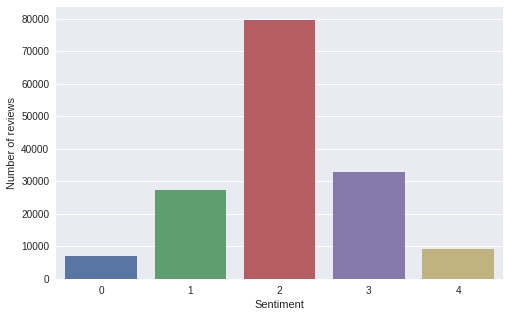
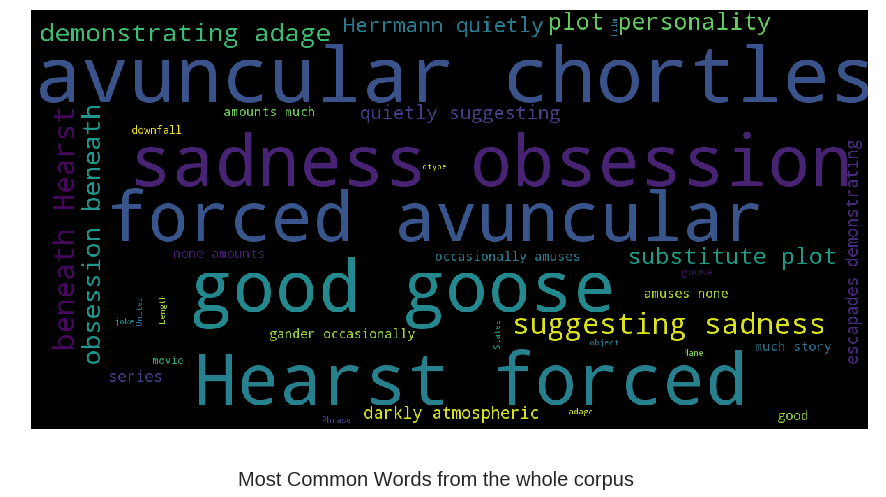

---
## Introduction
In this project, we'll be classifying the sentiment of sentences from the Rotten tomatoes dataset.The Rotten Tomatoes movie review dataset is a corpus of movie reviews used for sentiment analysis, originally collected by Pang and Lee [1]. In their work on sentiment treebanks, Socher et al. [2] used Amazon's Mechanical Turk to create fine-grained labels for all parsed phrases in the corpus. This competition presents a chance to benchmark your sentiment-analysis ideas on the Rotten Tomatoes dataset. You are asked to label phrases on a scale of five values: negative, somewhat negative, neutral, somewhat positive, positive. Obstacles like sentence negation, sarcasm, terseness, language ambiguity, and many others make this task very challenging.
We'll be combining LSTM, CNN, GRU Models for our implementation.


```python
!pip install wordcloud
```

    Collecting wordcloud
    [?25l  Downloading https://files.pythonhosted.org/packages/ae/af/849edf14d573eba9c8082db898ff0d090428d9485371cc4fe21a66717ad2/wordcloud-1.5.0-cp36-cp36m-manylinux1_x86_64.whl (361kB)
        100% |████████████████████████████████| 368kB 23.4MB/s 
    [?25hRequirement already satisfied: numpy>=1.6.1 in /usr/local/lib/python3.6/dist-packages (from wordcloud) (1.14.6)
    Requirement already satisfied: pillow in /usr/local/lib/python3.6/dist-packages (from wordcloud) (4.0.0)
    Requirement already satisfied: olefile in /usr/local/lib/python3.6/dist-packages (from pillow->wordcloud) (0.46)
    Installing collected packages: wordcloud
    Successfully installed wordcloud-1.5.0


```python
!pip install -U -q PyDrive
from pydrive.auth import GoogleAuth
from pydrive.drive import GoogleDrive
from google.colab import auth
from oauth2client.client import GoogleCredentials
import os
import pandas as pd
auth.authenticate_user()
gauth = GoogleAuth()
gauth.credentials = GoogleCredentials.get_application_default()
drive = GoogleDrive(gauth)
```

## Importing Libraries


```python
import numpy as np
import pandas as pd
import matplotlib.pyplot as plt
import seaborn as sns
%matplotlib inline

from nltk.tokenize import TweetTokenizer
import datetime
#import LightGBM as lgb
from scipy import stats
from scipy.sparse import hstack, csr_matrix
from sklearn.model_selection import train_test_split, cross_val_score
from wordcloud import WordCloud
from collections import Counter
from nltk.corpus import stopwords
from nltk.util import ngrams
from sklearn.feature_extraction.text import TfidfVectorizer
from sklearn.preprocessing import StandardScaler
from sklearn.linear_model import LogisticRegression
from sklearn.svm import LinearSVC
from sklearn.multiclass import OneVsRestClassifier
pd.set_option('max_colwidth',400)
```


```python
from google.colab import files
import io

uploaded = files.upload()
```


     <input type="file" id="files-e2b5f4f7-fccf-4f9a-8e82-812ba706cecf" name="files[]" multiple disabled />
     <output id="result-e2b5f4f7-fccf-4f9a-8e82-812ba706cecf">
      Upload widget is only available when the cell has been executed in the
      current browser session. Please rerun this cell to enable.
      </output>
      <script src="/nbextensions/google.colab/files.js"></script> 


    Saving test.tsv to test.tsv
    Saving train.tsv to train.tsv


```python
data = io.BytesIO(uploaded['train.tsv'])    
data1 = io.BytesIO(uploaded['test.tsv'])    
```

## Data Exploration


```python
train = pd.read_csv(data, sep="\t")
test = pd.read_csv(data1, sep="\t")
```


```python
train.head(10)
```


<div>
<style scoped>
    .dataframe tbody tr th:only-of-type {
        vertical-align: middle;
    }

    .dataframe tbody tr th {
        vertical-align: top;
    }

    .dataframe thead th {
        text-align: right;
    }
</style>
<table border="1" class="dataframe">
  <thead>
    <tr style="text-align: right;">
      <th></th>
      <th>PhraseId</th>
      <th>SentenceId</th>
      <th>Phrase</th>
      <th>Sentiment</th>
    </tr>
  </thead>
  <tbody>
    <tr>
      <th>0</th>
      <td>1</td>
      <td>1</td>
      <td>A series of escapades demonstrating the adage that what is good for the goose is also good for the gander , some of which occasionally amuses but none of which amounts to much of a story .</td>
      <td>1</td>
    </tr>
    <tr>
      <th>1</th>
      <td>2</td>
      <td>1</td>
      <td>A series of escapades demonstrating the adage that what is good for the goose</td>
      <td>2</td>
    </tr>
    <tr>
      <th>2</th>
      <td>3</td>
      <td>1</td>
      <td>A series</td>
      <td>2</td>
    </tr>
    <tr>
      <th>3</th>
      <td>4</td>
      <td>1</td>
      <td>A</td>
      <td>2</td>
    </tr>
    <tr>
      <th>4</th>
      <td>5</td>
      <td>1</td>
      <td>series</td>
      <td>2</td>
    </tr>
    <tr>
      <th>5</th>
      <td>6</td>
      <td>1</td>
      <td>of escapades demonstrating the adage that what is good for the goose</td>
      <td>2</td>
    </tr>
    <tr>
      <th>6</th>
      <td>7</td>
      <td>1</td>
      <td>of</td>
      <td>2</td>
    </tr>
    <tr>
      <th>7</th>
      <td>8</td>
      <td>1</td>
      <td>escapades demonstrating the adage that what is good for the goose</td>
      <td>2</td>
    </tr>
    <tr>
      <th>8</th>
      <td>9</td>
      <td>1</td>
      <td>escapades</td>
      <td>2</td>
    </tr>
    <tr>
      <th>9</th>
      <td>10</td>
      <td>1</td>
      <td>demonstrating the adage that what is good for the goose</td>
      <td>2</td>
    </tr>
  </tbody>
</table>
</div>


```python
train.loc[train.SentenceId == 3]
```


<div>
<style scoped>
    .dataframe tbody tr th:only-of-type {
        vertical-align: middle;
    }

    .dataframe tbody tr th {
        vertical-align: top;
    }

    .dataframe thead th {
        text-align: right;
    }
</style>
<table border="1" class="dataframe">
  <thead>
    <tr style="text-align: right;">
      <th></th>
      <th>PhraseId</th>
      <th>SentenceId</th>
      <th>Phrase</th>
      <th>Sentiment</th>
    </tr>
  </thead>
  <tbody>
    <tr>
      <th>81</th>
      <td>82</td>
      <td>3</td>
      <td>Even fans of Ismail Merchant 's work , I suspect , would have a hard time sitting through this one .</td>
      <td>1</td>
    </tr>
    <tr>
      <th>82</th>
      <td>83</td>
      <td>3</td>
      <td>Even fans of Ismail Merchant 's work</td>
      <td>2</td>
    </tr>
    <tr>
      <th>83</th>
      <td>84</td>
      <td>3</td>
      <td>Even fans</td>
      <td>2</td>
    </tr>
    <tr>
      <th>84</th>
      <td>85</td>
      <td>3</td>
      <td>Even</td>
      <td>2</td>
    </tr>
    <tr>
      <th>85</th>
      <td>86</td>
      <td>3</td>
      <td>fans</td>
      <td>3</td>
    </tr>
    <tr>
      <th>86</th>
      <td>87</td>
      <td>3</td>
      <td>of Ismail Merchant 's work</td>
      <td>2</td>
    </tr>
    <tr>
      <th>87</th>
      <td>88</td>
      <td>3</td>
      <td>Ismail Merchant 's work</td>
      <td>2</td>
    </tr>
    <tr>
      <th>88</th>
      <td>89</td>
      <td>3</td>
      <td>Ismail Merchant 's</td>
      <td>2</td>
    </tr>
    <tr>
      <th>89</th>
      <td>90</td>
      <td>3</td>
      <td>Ismail</td>
      <td>2</td>
    </tr>
    <tr>
      <th>90</th>
      <td>91</td>
      <td>3</td>
      <td>Merchant 's</td>
      <td>2</td>
    </tr>
    <tr>
      <th>91</th>
      <td>92</td>
      <td>3</td>
      <td>Merchant</td>
      <td>2</td>
    </tr>
    <tr>
      <th>92</th>
      <td>93</td>
      <td>3</td>
      <td>'s</td>
      <td>2</td>
    </tr>
    <tr>
      <th>93</th>
      <td>94</td>
      <td>3</td>
      <td>work</td>
      <td>2</td>
    </tr>
    <tr>
      <th>94</th>
      <td>95</td>
      <td>3</td>
      <td>, I suspect , would have a hard time sitting through this one .</td>
      <td>1</td>
    </tr>
    <tr>
      <th>95</th>
      <td>96</td>
      <td>3</td>
      <td>, I suspect ,</td>
      <td>2</td>
    </tr>
    <tr>
      <th>96</th>
      <td>97</td>
      <td>3</td>
      <td>I suspect ,</td>
      <td>2</td>
    </tr>
    <tr>
      <th>97</th>
      <td>98</td>
      <td>3</td>
      <td>I suspect</td>
      <td>2</td>
    </tr>
    <tr>
      <th>98</th>
      <td>99</td>
      <td>3</td>
      <td>I</td>
      <td>2</td>
    </tr>
    <tr>
      <th>99</th>
      <td>100</td>
      <td>3</td>
      <td>suspect</td>
      <td>2</td>
    </tr>
    <tr>
      <th>100</th>
      <td>101</td>
      <td>3</td>
      <td>would have a hard time sitting through this one .</td>
      <td>1</td>
    </tr>
    <tr>
      <th>101</th>
      <td>102</td>
      <td>3</td>
      <td>would have a hard time sitting through this one</td>
      <td>0</td>
    </tr>
    <tr>
      <th>102</th>
      <td>103</td>
      <td>3</td>
      <td>would</td>
      <td>2</td>
    </tr>
    <tr>
      <th>103</th>
      <td>104</td>
      <td>3</td>
      <td>have a hard time sitting through this one</td>
      <td>0</td>
    </tr>
    <tr>
      <th>104</th>
      <td>105</td>
      <td>3</td>
      <td>have</td>
      <td>2</td>
    </tr>
    <tr>
      <th>105</th>
      <td>106</td>
      <td>3</td>
      <td>a hard time sitting through this one</td>
      <td>1</td>
    </tr>
    <tr>
      <th>106</th>
      <td>107</td>
      <td>3</td>
      <td>a hard time</td>
      <td>1</td>
    </tr>
    <tr>
      <th>107</th>
      <td>108</td>
      <td>3</td>
      <td>hard time</td>
      <td>1</td>
    </tr>
    <tr>
      <th>108</th>
      <td>109</td>
      <td>3</td>
      <td>hard</td>
      <td>2</td>
    </tr>
    <tr>
      <th>109</th>
      <td>110</td>
      <td>3</td>
      <td>time</td>
      <td>2</td>
    </tr>
    <tr>
      <th>110</th>
      <td>111</td>
      <td>3</td>
      <td>sitting through this one</td>
      <td>1</td>
    </tr>
    <tr>
      <th>111</th>
      <td>112</td>
      <td>3</td>
      <td>sitting</td>
      <td>2</td>
    </tr>
    <tr>
      <th>112</th>
      <td>113</td>
      <td>3</td>
      <td>through this one</td>
      <td>2</td>
    </tr>
    <tr>
      <th>113</th>
      <td>114</td>
      <td>3</td>
      <td>through</td>
      <td>2</td>
    </tr>
    <tr>
      <th>114</th>
      <td>115</td>
      <td>3</td>
      <td>this one</td>
      <td>2</td>
    </tr>
    <tr>
      <th>115</th>
      <td>116</td>
      <td>3</td>
      <td>one</td>
      <td>2</td>
    </tr>
  </tbody>
</table>
</div>


```python
print('Average count of phrases per sentence in train is {0:.0f}.'.format(train.groupby('SentenceId')['Phrase'].count().mean()))
print('Average count of phrases per sentence in test is {0:.0f}.'.format(test.groupby('SentenceId')['Phrase'].count().mean()))
```

    Average count of phrases per sentence in train is 18.
    Average count of phrases per sentence in test is 20.


```python
print('Number of phrases in train: {}. Number of sentences in train: {}.'.format(train.shape[0], len(train.SentenceId.unique())))
print('Number of phrases in test: {}. Number of sentences in test: {}.'.format(test.shape[0], len(test.SentenceId.unique())))
```

    Number of phrases in train: 156060. Number of sentences in train: 8529.
    Number of phrases in test: 66292. Number of sentences in test: 3310.


```python
print('Average word length of phrases in train is {0:.0f}.'.format(np.mean(train['Phrase'].apply(lambda x: len(x.split())))))
print('Average word length of phrases in test is {0:.0f}.'.format(np.mean(test['Phrase'].apply(lambda x: len(x.split())))))
```

    Average word length of phrases in train is 7.
    Average word length of phrases in test is 7.


```python
text = ' '.join(train.loc[train.SentenceId == 4, 'Phrase'].values)
text = [i for i in ngrams(text.split(), 3)]
```


```python
print('Number of sentences in training set:',len(train['SentenceId'].unique()))
print('Number of sentences in test set:',len(test['SentenceId'].unique()))
print('Average words per sentence in train:',train.groupby('SentenceId')['Phrase'].count().mean())
print('Average words per sentence in test:',test.groupby('SentenceId')['Phrase'].count().mean())
```

    Number of sentences in training set: 8529
    Number of sentences in test set: 3310
    Average words per sentence in train: 18.297572986282095
    Average words per sentence in test: 20.027794561933536


```python
class_count = train['Sentiment'].value_counts()
class_count
```


    2    79582
    3    32927
    1    27273
    4     9206
    0     7072
    Name: Sentiment, dtype: int64


```python
x = np.array(class_count.index)
y = np.array(class_count.values)
plt.figure(figsize=(8,5))
sns.barplot(x,y)
plt.xlabel("Sentiment")
plt.ylabel("Number of reviews")
```

    /usr/local/lib/python3.6/dist-packages/seaborn/categorical.py:1428: FutureWarning: remove_na is deprecated and is a private function. Do not use.
      stat_data = remove_na(group_data)


    Text(0,0.5,'Number of reviews')





## The sentiment labels are:
0 - negative 1 - somewhat negative 2 - neutral 3 - somewhat positive 4 - positive


```python
from sklearn.preprocessing import OneHotEncoder

enc = OneHotEncoder(sparse=False)
enc.fit(train["Sentiment"].values.reshape(-1, 1))
print("Number of classes:", enc.n_values_[0])

print("Class distribution:\n{}".format(train["Sentiment"].value_counts()/train.shape[0]))
```

    Number of classes: 5
    Class distribution:
    2    0.509945
    3    0.210989
    1    0.174760
    4    0.058990
    0    0.045316
    Name: Sentiment, dtype: float64


```python
from wordcloud import WordCloud, STOPWORDS
import matplotlib.pyplot as plt
stopwords = set(STOPWORDS)

def show_wordcloud(data, title = None):
    wordcloud = WordCloud(
        background_color='black',
        stopwords=stopwords,
        max_words=200,
        max_font_size=40, 
        scale=3,
        random_state=1 # chosen at random by flipping a coin; it was heads
).generate(str(data))

    fig = plt.figure(1, figsize=(15, 15))
    plt.axis('off')
    if title: 
        fig.suptitle(title, fontsize=20)
        fig.subplots_adjust(top=2.3)

    plt.imshow(wordcloud)
    plt.show()
```


```python
show_wordcloud(train['Phrase'],'Most Common Words from the whole corpus')
```





```python
show_wordcloud(train[train['Sentiment'] == 0]['Phrase'],'Negative Reviews')
```


```python
show_wordcloud(train[train['Sentiment'] == 1]['Phrase'],'Somewhat Negative Reviews')
```


```python
show_wordcloud(train[train['Sentiment'] == 2]['Phrase'],'Neutral Reviews')
```


```python
show_wordcloud(train[train['Sentiment'] == 3]['Phrase'],'Somewhat Positive Reviews')
```


```python
show_wordcloud(train[train['Sentiment'] == 4]['Phrase'],'Postive Reviews')
```


```python
from sklearn.feature_extraction.text import CountVectorizer

cv1 = CountVectorizer()
cv1.fit(train["Phrase"])

cv2 = CountVectorizer()
cv2.fit(test["Phrase"])

print("Train Set Vocabulary Size:", len(cv1.vocabulary_))
print("Test Set Vocabulary Size:", len(cv2.vocabulary_))
print("Number of Words that occur in both:", len(set(cv1.vocabulary_.keys()).intersection(set(cv2.vocabulary_.keys()))))
```

    Train Set Vocabulary Size: 15240
    Test Set Vocabulary Size: 9546
    Number of Words that occur in both: 7057


So we have phrases as data, a phrase can have a single word and a punctuation mark and it could mean a totally different sentiment. Also assigned sentiments can be strange. This means several things:
* using stopwords can be a bad idea, especially when phrases contain one single stopword;
* puntuation could be important, so it should be used;
* ngrams are necessary to get the most info from data;
* using features like word count or sentence length won't be useful;

## Machine Learning


```python
from nltk.tokenize import TweetTokenizer
from sklearn.feature_extraction.text import TfidfVectorizer
tokenizer = TweetTokenizer()
```

## N-Grams


```python
vectorizer = TfidfVectorizer(ngram_range=(1, 3), tokenizer=tokenizer.tokenize)
full_text = list(train['Phrase'].values) + list(test['Phrase'].values)
vectorizer.fit(full_text)
train_vectorized = vectorizer.transform(train['Phrase'])
test_vectorized = vectorizer.transform(test['Phrase'])
```


```python
y = train['Sentiment']
```


```python
from sklearn.model_selection import train_test_split
x_train , x_val, y_train , y_val = train_test_split(train_vectorized,y,test_size = 0.2)
```


```python
from sklearn.linear_model import LogisticRegression
from sklearn.svm import LinearSVC
from sklearn.ensemble import RandomForestClassifier
from sklearn.ensemble import VotingClassifier
from sklearn.multiclass import OneVsRestClassifier
```


```python
from sklearn.metrics import classification_report
from sklearn.metrics import accuracy_score
```

## Training Logistic Reagression model and an SVM.


```python
lr = LogisticRegression()
ovr = OneVsRestClassifier(lr)
ovr.fit(x_train,y_train)
print(classification_report( ovr.predict(x_val) , y_val))
print(accuracy_score( ovr.predict(x_val) , y_val ))
```

                 precision    recall  f1-score   support
    
              0       0.18      0.67      0.29       392
              1       0.33      0.57      0.42      3160
              2       0.91      0.65      0.76     22377
              3       0.42      0.60      0.50      4658
              4       0.22      0.65      0.33       625
    
    avg / total       0.76      0.63      0.67     31212
    
    0.6325451749327182


```python
svm = LinearSVC()
svm.fit(x_train,y_train)
print(classification_report( svm.predict(x_val) , y_val))
print(accuracy_score( svm.predict(x_val) , y_val ))
```

                 precision    recall  f1-score   support
    
              0       0.40      0.52      0.46      1100
              1       0.50      0.56      0.53      4895
              2       0.82      0.73      0.77     17857
              3       0.52      0.58      0.55      5906
              4       0.42      0.52      0.46      1454
    
    avg / total       0.68      0.66      0.66     31212
    
    0.6561258490324234


```python

estimators = [ ('svm',svm) , ('ovr' , ovr) ]
clf = VotingClassifier(estimators , voting='hard')
clf.fit(x_train,y_train)
print(classification_report( clf.predict(x_val) , y_val))
print(accuracy_score( clf.predict(x_val) , y_val ))

```

    /usr/local/lib/python3.6/dist-packages/sklearn/preprocessing/label.py:151: DeprecationWarning: The truth value of an empty array is ambiguous. Returning False, but in future this will result in an error. Use `array.size > 0` to check that an array is not empty.
      if diff:


                 precision    recall  f1-score   support
    
              0       0.41      0.52      0.45      1117
              1       0.51      0.56      0.53      5056
              2       0.86      0.68      0.76     19996
              3       0.41      0.61      0.49      4441
              4       0.22      0.66      0.33       602
    
    avg / total       0.71      0.65      0.67     31212
    
    0.6471549404075355


    /usr/local/lib/python3.6/dist-packages/sklearn/preprocessing/label.py:151: DeprecationWarning: The truth value of an empty array is ambiguous. Returning False, but in future this will result in an error. Use `array.size > 0` to check that an array is not empty.
      if diff:


```python
from keras.utils import to_categorical
target=train.Sentiment.values
y=to_categorical(target)
y
```

    Using TensorFlow backend.


    array([[0., 1., 0., 0., 0.],
           [0., 0., 1., 0., 0.],
           [0., 0., 1., 0., 0.],
           ...,
           [0., 0., 0., 1., 0.],
           [0., 0., 1., 0., 0.],
           [0., 0., 1., 0., 0.]], dtype=float32)


```python
max_features = 13000
max_words = 50
batch_size = 128
epochs = 3
num_classes=5
```


```python
from sklearn.model_selection import train_test_split
X_train , X_val , Y_train , Y_val = train_test_split(train['Phrase'],y,test_size = 0.20)
```


```python
from keras.preprocessing.text import Tokenizer
from keras.preprocessing.sequence import pad_sequences
from keras.models import Sequential
from keras.layers import Dense,GRU,LSTM,Embedding
from keras.optimizers import Adam
from keras.layers import SpatialDropout1D,Dropout,Bidirectional,Conv1D,GlobalMaxPooling1D,MaxPooling1D,Flatten
from keras.callbacks import ModelCheckpoint, TensorBoard, Callback, EarlyStopping

```


```python
tokenizer = Tokenizer(num_words=max_features)
tokenizer.fit_on_texts(list(X_train))
X_train = tokenizer.texts_to_sequences(X_train)
X_val = tokenizer.texts_to_sequences(X_val)

```


```python
X_test = tokenizer.texts_to_sequences(test['Phrase'])
X_test =pad_sequences(X_test, maxlen=max_words)
```


```python
X_train =pad_sequences(X_train, maxlen=max_words)
X_val = pad_sequences(X_val, maxlen=max_words)
X_test =pad_sequences(X_test, maxlen=max_words)
```

## GRU


```python
model_GRU=Sequential()
model_GRU.add(Embedding(max_features,100,mask_zero=True))
model_GRU.add(GRU(64,dropout=0.4,return_sequences=True))
model_GRU.add(GRU(32,dropout=0.5,return_sequences=False))
model_GRU.add(Dense(num_classes,activation='softmax'))
model_GRU.compile(loss='categorical_crossentropy',optimizer=Adam(lr = 0.001),metrics=['accuracy'])
model_GRU.summary()
```

    _________________________________________________________________
    Layer (type)                 Output Shape              Param #   
    =================================================================
    embedding_1 (Embedding)      (None, None, 100)         1300000   
    _________________________________________________________________
    gru_1 (GRU)                  (None, None, 64)          31680     
    _________________________________________________________________
    gru_2 (GRU)                  (None, 32)                9312      
    _________________________________________________________________
    dense_1 (Dense)              (None, 5)                 165       
    =================================================================
    Total params: 1,341,157
    Trainable params: 1,341,157
    Non-trainable params: 0
    _________________________________________________________________


```python
%%time
history1=model_GRU.fit(X_train, Y_train, validation_data=(X_val, Y_val),epochs=epochs, batch_size=batch_size, verbose=1)
```

    Train on 124848 samples, validate on 31212 samples
    Epoch 1/3
    124848/124848 [==============================] - 258s 2ms/step - loss: 1.0478 - acc: 0.5891 - val_loss: 0.8912 - val_acc: 0.6418
    Epoch 2/3
    124848/124848 [==============================] - 255s 2ms/step - loss: 0.8332 - acc: 0.6636 - val_loss: 0.8555 - val_acc: 0.6570
    Epoch 3/3
    124848/124848 [==============================] - 255s 2ms/step - loss: 0.7752 - acc: 0.6843 - val_loss: 0.8376 - val_acc: 0.6626
    CPU times: user 16min 47s, sys: 1min 57s, total: 18min 45s
    Wall time: 12min 50s


```python
y_pred1=model_GRU.predict_classes(X_test, verbose=1)
```

    66292/66292 [==============================] - 160s 2ms/step


```python
model2_GRU=Sequential()
model2_GRU.add(Embedding(max_features,100,mask_zero=True))
model2_GRU.add(GRU(64,dropout=0.4,return_sequences=True))
model2_GRU.add(GRU(32,dropout=0.5,return_sequences=False))
model2_GRU.add(Dense(num_classes,activation='sigmoid'))
model2_GRU.compile(loss='binary_crossentropy',optimizer=Adam(lr = 0.001),metrics=['accuracy'])
model2_GRU.summary()

```

    _________________________________________________________________
    Layer (type)                 Output Shape              Param #   
    =================================================================
    embedding_6 (Embedding)      (None, None, 100)         1300000   
    _________________________________________________________________
    gru_6 (GRU)                  (None, None, 64)          31680     
    _________________________________________________________________
    gru_7 (GRU)                  (None, 32)                9312      
    _________________________________________________________________
    dense_8 (Dense)              (None, 5)                 165       
    =================================================================
    Total params: 1,341,157
    Trainable params: 1,341,157
    Non-trainable params: 0
    _________________________________________________________________


```python
%%time
history2=model2_GRU.fit(X_train, Y_train, validation_data=(X_val, Y_val),epochs=epochs, batch_size=batch_size, verbose=1)
```

    Train on 124848 samples, validate on 31212 samples
    Epoch 1/3
    124848/124848 [==============================] - 268s 2ms/step - loss: 0.3751 - acc: 0.8435 - val_loss: 0.3178 - val_acc: 0.8570
    Epoch 2/3
    124848/124848 [==============================] - 267s 2ms/step - loss: 0.2974 - acc: 0.8665 - val_loss: 0.3047 - val_acc: 0.8640
    Epoch 3/3
    124848/124848 [==============================] - 266s 2ms/step - loss: 0.2797 - acc: 0.8751 - val_loss: 0.2998 - val_acc: 0.8671
    CPU times: user 17min 38s, sys: 2min, total: 19min 38s
    Wall time: 13min 22s


```python
y_pred2=model2_GRU.predict_classes(X_test, verbose=1)

```

    66292/66292 [==============================] - 165s 2ms/step


## LSTM


```python
model3_LSTM=Sequential()
model3_LSTM.add(Embedding(max_features,100,mask_zero=True))
model3_LSTM.add(LSTM(64,dropout=0.4,return_sequences=True))
model3_LSTM.add(LSTM(32,dropout=0.5,return_sequences=False))
model3_LSTM.add(Dense(num_classes,activation='sigmoid'))
model3_LSTM.compile(loss='binary_crossentropy',optimizer=Adam(lr = 0.001),metrics=['accuracy'])
model3_LSTM.summary()
```

    _________________________________________________________________
    Layer (type)                 Output Shape              Param #   
    =================================================================
    embedding_2 (Embedding)      (None, None, 100)         1300000   
    _________________________________________________________________
    lstm_1 (LSTM)                (None, None, 64)          42240     
    _________________________________________________________________
    lstm_2 (LSTM)                (None, 32)                12416     
    _________________________________________________________________
    dense_2 (Dense)              (None, 5)                 165       
    =================================================================
    Total params: 1,354,821
    Trainable params: 1,354,821
    Non-trainable params: 0
    _________________________________________________________________


```python
%%time
history3=model3_LSTM.fit(X_train, Y_train, validation_data=(X_val, Y_val),epochs=epochs, batch_size=batch_size, verbose=1)
```

    Train on 124848 samples, validate on 31212 samples
    Epoch 1/3
    124848/124848 [==============================] - 318s 3ms/step - loss: 0.4050 - acc: 0.8386 - val_loss: 0.3618 - val_acc: 0.8506
    Epoch 2/3
    124848/124848 [==============================] - 316s 3ms/step - loss: 0.3320 - acc: 0.8566 - val_loss: 0.3185 - val_acc: 0.8576
    Epoch 3/3
    124848/124848 [==============================] - 315s 3ms/step - loss: 0.2886 - acc: 0.8697 - val_loss: 0.3055 - val_acc: 0.8644
    CPU times: user 20min 21s, sys: 2min 23s, total: 22min 45s
    Wall time: 15min 51s


```python
y_pred3=model3_LSTM.predict_classes(X_test, verbose=1)
```

    66292/66292 [==============================] - 191s 3ms/step


## Bidirectional GRU


```python
model4_BGRU = Sequential()
model4_BGRU.add(Embedding(max_features, 100, input_length=max_words))
model4_BGRU.add(SpatialDropout1D(0.25))
model4_BGRU.add(Bidirectional(GRU(64,dropout=0.4,return_sequences = True)))
model4_BGRU.add(Bidirectional(GRU(32,dropout=0.5,return_sequences = False)))
model4_BGRU.add(Dense(5, activation='sigmoid'))
model4_BGRU.compile(loss='binary_crossentropy', optimizer='adam', metrics=['accuracy'])
model4_BGRU.summary()
```

    _________________________________________________________________
    Layer (type)                 Output Shape              Param #   
    =================================================================
    embedding_3 (Embedding)      (None, 50, 100)           1300000   
    _________________________________________________________________
    spatial_dropout1d_1 (Spatial (None, 50, 100)           0         
    _________________________________________________________________
    bidirectional_1 (Bidirection (None, 50, 128)           63360     
    _________________________________________________________________
    bidirectional_2 (Bidirection (None, 64)                30912     
    _________________________________________________________________
    dense_3 (Dense)              (None, 5)                 325       
    =================================================================
    Total params: 1,394,597
    Trainable params: 1,394,597
    Non-trainable params: 0
    _________________________________________________________________


```python
%%time
history4=model4_BGRU.fit(X_train, Y_train, validation_data=(X_val, Y_val),epochs=epochs, batch_size=batch_size, verbose=1)
```

    Train on 124848 samples, validate on 31212 samples
    Epoch 1/3
    124848/124848 [==============================] - 394s 3ms/step - loss: 0.3492 - acc: 0.8463 - val_loss: 0.3079 - val_acc: 0.8592
    Epoch 2/3
    124848/124848 [==============================] - 389s 3ms/step - loss: 0.2912 - acc: 0.8683 - val_loss: 0.2956 - val_acc: 0.8664
    Epoch 3/3
    124848/124848 [==============================] - 387s 3ms/step - loss: 0.2758 - acc: 0.8760 - val_loss: 0.2922 - val_acc: 0.8677
    CPU times: user 23min 1s, sys: 2min 28s, total: 25min 29s
    Wall time: 19min 33s


```python
y_pred4=model4_BGRU.predict_classes(X_test, verbose=1)
```

    66292/66292 [==============================] - 202s 3ms/step


## CNN


```python
model5_CNN= Sequential()
model5_CNN.add(Embedding(max_features,100,input_length=max_words))
model5_CNN.add(Dropout(0.2))
model5_CNN.add(Conv1D(64,kernel_size=3,padding='same',activation='relu',strides=1))
model5_CNN.add(GlobalMaxPooling1D())
model5_CNN.add(Dense(128,activation='relu'))
model5_CNN.add(Dropout(0.2))
model5_CNN.add(Dense(num_classes,activation='sigmoid'))
model5_CNN.compile(loss='binary_crossentropy',optimizer='adam',metrics=['accuracy'])
model5_CNN.summary()
```

    _________________________________________________________________
    Layer (type)                 Output Shape              Param #   
    =================================================================
    embedding_4 (Embedding)      (None, 50, 100)           1300000   
    _________________________________________________________________
    dropout_1 (Dropout)          (None, 50, 100)           0         
    _________________________________________________________________
    conv1d_1 (Conv1D)            (None, 50, 64)            19264     
    _________________________________________________________________
    global_max_pooling1d_1 (Glob (None, 64)                0         
    _________________________________________________________________
    dense_4 (Dense)              (None, 128)               8320      
    _________________________________________________________________
    dropout_2 (Dropout)          (None, 128)               0         
    _________________________________________________________________
    dense_5 (Dense)              (None, 5)                 645       
    =================================================================
    Total params: 1,328,229
    Trainable params: 1,328,229
    Non-trainable params: 0
    _________________________________________________________________


```python
%%time
early_stop = EarlyStopping(monitor = "val_loss", mode = "min", patience = 3)

history5=model5_CNN.fit(X_train, Y_train, validation_data=(X_val, Y_val),epochs=3, batch_size=batch_size, verbose=1,callbacks = [early_stop])

```

    Train on 124848 samples, validate on 31212 samples
    Epoch 1/3
    124848/124848 [==============================] - 13s 102us/step - loss: 0.3461 - acc: 0.8475 - val_loss: 0.3058 - val_acc: 0.8617
    Epoch 2/3
    124848/124848 [==============================] - 11s 86us/step - loss: 0.2813 - acc: 0.8729 - val_loss: 0.2932 - val_acc: 0.8659
    Epoch 3/3
    124848/124848 [==============================] - 11s 86us/step - loss: 0.2572 - acc: 0.8839 - val_loss: 0.2897 - val_acc: 0.8675
    CPU times: user 36.5 s, sys: 6.75 s, total: 43.2 s
    Wall time: 34.8 s


```python
y_pred5=model5_CNN.predict_classes(X_test, verbose=1)

```

    66292/66292 [==============================] - 4s 57us/step


## GRU-CNN


```python
model6_GruCNN = Sequential()
model6_GruCNN.add(Embedding(max_features,100,input_length=max_words))
model6_GruCNN.add(Dropout(0.2))
model6_GruCNN.add(Bidirectional(GRU(units=128 , return_sequences=True)))
model6_GruCNN.add(Conv1D(32 , kernel_size=3 , padding='same' , activation='relu'))
model6_GruCNN.add(GlobalMaxPooling1D())
model6_GruCNN.add(Dense(units = 64 , activation='relu'))
model6_GruCNN.add(Dropout(0.5))
model6_GruCNN.add(Dense(units=5,activation='sigmoid'))
model6_GruCNN.compile(loss='binary_crossentropy' , optimizer = 'adam' , metrics=['accuracy'])
model6_GruCNN.summary()
```

    _________________________________________________________________
    Layer (type)                 Output Shape              Param #   
    =================================================================
    embedding_5 (Embedding)      (None, 50, 100)           1300000   
    _________________________________________________________________
    dropout_3 (Dropout)          (None, 50, 100)           0         
    _________________________________________________________________
    bidirectional_3 (Bidirection (None, 50, 256)           175872    
    _________________________________________________________________
    conv1d_2 (Conv1D)            (None, 50, 32)            24608     
    _________________________________________________________________
    global_max_pooling1d_2 (Glob (None, 32)                0         
    _________________________________________________________________
    dense_6 (Dense)              (None, 64)                2112      
    _________________________________________________________________
    dropout_4 (Dropout)          (None, 64)                0         
    _________________________________________________________________
    dense_7 (Dense)              (None, 5)                 325       
    =================================================================
    Total params: 1,502,917
    Trainable params: 1,502,917
    Non-trainable params: 0
    _________________________________________________________________


```python
%%time
history7 = model6_GruCNN.fit(X_train, Y_train, validation_data=(X_val, Y_val),epochs=4, batch_size=batch_size, verbose=1,callbacks=[early_stop])

```

    Train on 124848 samples, validate on 31212 samples
    Epoch 1/4
    124848/124848 [==============================] - 198s 2ms/step - loss: 0.3748 - acc: 0.8388 - val_loss: 0.3092 - val_acc: 0.8570
    Epoch 2/4
    124848/124848 [==============================] - 196s 2ms/step - loss: 0.2996 - acc: 0.8649 - val_loss: 0.2951 - val_acc: 0.8651
    Epoch 3/4
    124848/124848 [==============================] - 194s 2ms/step - loss: 0.2769 - acc: 0.8756 - val_loss: 0.2943 - val_acc: 0.8667
    Epoch 4/4
    124848/124848 [==============================] - 194s 2ms/step - loss: 0.2620 - acc: 0.8823 - val_loss: 0.2959 - val_acc: 0.8682
    CPU times: user 14min 5s, sys: 1min 24s, total: 15min 30s
    Wall time: 13min 4s


```python
y_pred6=model6_GruCNN.predict_classes(X_test, verbose=1)
```

    66292/66292 [==============================] - 97s 1ms/step


## Ensemble


```python
all=pd.DataFrame({'model1':y_pred1,'model2':y_pred2,'model3':y_pred3,'model4':y_pred4,'model5':y_pred5,'model6':y_pred6})
pred_mode=all.agg('mode',axis=1)[0].values
all.head()

```


<div>
<style scoped>
    .dataframe tbody tr th:only-of-type {
        vertical-align: middle;
    }

    .dataframe tbody tr th {
        vertical-align: top;
    }

    .dataframe thead th {
        text-align: right;
    }
</style>
<table border="1" class="dataframe">
  <thead>
    <tr style="text-align: right;">
      <th></th>
      <th>model1</th>
      <th>model2</th>
      <th>model3</th>
      <th>model4</th>
      <th>model5</th>
      <th>model6</th>
    </tr>
  </thead>
  <tbody>
    <tr>
      <th>0</th>
      <td>2</td>
      <td>2</td>
      <td>2</td>
      <td>2</td>
      <td>2</td>
      <td>2</td>
    </tr>
    <tr>
      <th>1</th>
      <td>2</td>
      <td>2</td>
      <td>2</td>
      <td>2</td>
      <td>2</td>
      <td>2</td>
    </tr>
    <tr>
      <th>2</th>
      <td>2</td>
      <td>2</td>
      <td>2</td>
      <td>2</td>
      <td>2</td>
      <td>2</td>
    </tr>
    <tr>
      <th>3</th>
      <td>2</td>
      <td>2</td>
      <td>2</td>
      <td>2</td>
      <td>2</td>
      <td>2</td>
    </tr>
    <tr>
      <th>4</th>
      <td>2</td>
      <td>2</td>
      <td>2</td>
      <td>2</td>
      <td>2</td>
      <td>2</td>
    </tr>
  </tbody>
</table>
</div>


